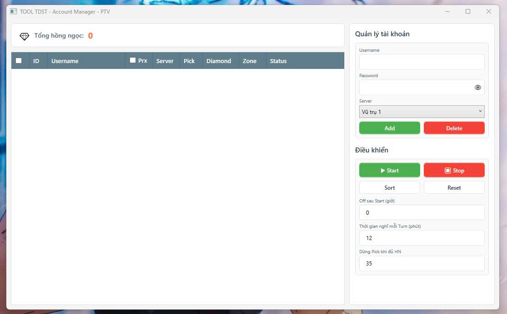

<p align="center">
  <h1 align="center">Tool TDST</h1>
  <p align="center">
    <b>Tool săn Boss Tiểu Đội Sát Thủ Namec — Ngọc Rồng Online</b>
    <br/>
    Tự động dò boss · Kẹp khu · Đánh boss · Nhặt Hồng Ngọc
  </p>
</p>

---

## Giới thiệu

**Tool-TDST** là dự án mã nguồn mở hỗ trợ săn Boss **Tiểu Đội Sát Thủ** trên hành tinh **Namec** trong game **Ngọc Rồng Online**. Tool được thiết kế để tự động hóa toàn bộ quy trình từ dò tìm, kẹp khu, chiến đấu boss đến nhặt Hồng Ngọc — giúp tối ưu hiệu suất và giảm thiểu thao tác thủ công.



---

## Tính năng chính

| Tính năng                | Mô tả                                                                                   |
| ------------------------ | --------------------------------------------------------------------------------------- |
| **Dò Boss**              | Khi boss xuất hiện, từng tài khoản sẽ vào khu tương ứng                                 |
| **Kẹp Khu**              | Tài khoản tìm thấy boss sẽ thông báo cho tất cả tài khoản khác vào                      |
| **Đánh Boss**            | Tự động tấn công boss với chiến thuật tối ưu theo vai trò (đánh/nhặt)                   |
| **Nhặt Hồng Ngọc**       | Tự động nhặt Hồng Ngọc rơi ra sau khi boss bị hạ                                        |
| **Auto Login**           | Tự động đăng nhập lại sau***X phút*** khoảng nghỉ giữa các đợt boss                     |
| **Auto Stop**            | Tự động dừng sau***X giờ*** kể từ lúc nhấn Start                                        |
| **Giới hạn Hồng Ngọc**   | Tự động dừng nhặt khi đạt đủ số Hồng Ngọc mong muốn                                     |
| **Nhặt ngọc thông minh** | Tài khoản không nhặt sẽ dừng đánh boss khi HP dưới**1 triệu** để tài khoản nhặt ăn boss |
| **GoBack tự động**       | Tự động quay về đúng vị trí, map và khu chờ boss tương ứng                              |
| **Hỗ trợ Proxy**         | Tùy chọn sử dụng proxy chia đều cho từng tài khoản                                      |

---

## Kiến trúc dự án

```
TOOL/
├── QLTK_TOOL_TDST/          # 🖥️ WPF App - Quản lý tài khoản & điều khiển
│   ├── MainWindow.xaml       #    Giao diện chính
│   ├── Models/
│   │   ├── Account.cs        #    Model tài khoản (username, server, pick, proxy...)
│   │   ├── Boss.cs           #    Model boss (tên, map, khu, trạng thái)
│   │   ├── Proxy.cs          #    Model proxy
│   │   └── Server.cs         #    Model server
│   ├── ProcessManager.cs     #    Quản lý tiến trình game client
│   └── AsynchronousSocketListener.cs  #  Socket giao tiếp với game client
│
├── AssemblyCSharp/            # 🎮 Game Client Logic (Unity Assembly)
```

---

## Hướng dẫn sử dụng

### Cài đặt

1. Tải bảng build ở [releases](https://github.com/ptvuong2505/Tool-Nro-TDST/releases)
2. Nếu muốn custom thì clone repo này

### Chạy Tool

1. Khởi chạy `QLTK_TOOL_TDST.exe` trong thư mục `TOOL_TDST/`.
2. **Thêm tài khoản**: Nhập Username, Password, chọn Server → nhấn **Add**.
3. **Cấu hình**:
   - Tick cột **Pick** cho các tài khoản sẽ nhặt Hồng Ngọc.
   - Đặt **"Off sau Start"** (số giờ tool tự dừng, nhập `0` để không giới hạn).
   - Đặt **"Thời gian nghỉ mỗi Turn"** (phút nghỉ giữa các đợt boss, mặc định `12` phút).
   - Đặt **"Dừng Pick khi đủ HN"** (số Hồng Ngọc mong muốn, nhập `0` để không giới hạn).
4. Chọn tài khoản cần chạy → Nhấn **▶ Start**.

### Cơ chế hoạt động

1. Đăng nhập
2. Chạy tới map chờ (Thung Lũng Maima)
3. Từng tài khoản sẽ vào từng khu từ trên xuống (2-15)
4. Boss ra trong Map sẽ được tài khoản trong khu đó gửi tín hiệu để các tài khoản còn lại vào khu.
5. Nếu boss ra ở Map khác, toàn bộ tài khoản sẽ chạy tới map và chuyển vào khu tương ứng như khu chờ
6. Ăn boss xong thì off

- **Tài khoản đánh** (không tick Pick): Đánh boss, tự dừng khi HP boss < 1.000.000 để nhường cho tài khoản nhặt.
- **Tài khoản nhặt** (tick Pick): Đánh boss đến chết, sau đó nhặt Hồng Ngọc.
- Sau mỗi đợt boss, tool tự nghỉ theo thời gian cấu hình rồi auto đăng nhập lại chờ đợt tiếp theo.
- Khi đủ số Hồng Ngọc mong muốn, tài khoản tự dừng nhặt (tự bỏ tick Pick).

---

## Công nghệ sử dụng

- **C# / .NET 9.0** — Ngôn ngữ lập trình chính
- **WPF (Windows Presentation Foundation)** — Giao diện quản lý tài khoản
- **Unity Engine** — Game client
- **Socket (TCP)** — Giao tiếp giữa WPF Manager và Game Client
- **Newtonsoft.Json** — Serialize/Deserialize dữ liệu tài khoản

---

## Cấu hình dữ liệu

| File                                | Mô tả                                                         |
| ----------------------------------- | ------------------------------------------------------------- |
| `Data/accounts.json`                | Danh sách tài khoản (username, password, server, proxy, pick) |
| `Data/proxies.txt`                  | Danh sách proxy (mỗi dòng 1 proxy)                            |
| `TextData/AutoLinkMapsWaypoint.txt` | Waypoint di chuyển tự động giữa các map                       |
| `TextData/GroupMapsXmap.txt`        | Cấu hình nhóm map                                             |
| `TextData/LinkMapsXmap.txt`         | Liên kết di chuyển giữa các map                               |

---

## Lưu ý

> **Disclaimer**: Dự án này được phát triển với mục đích học tập và nghiên cứu. Việc sử dụng tool trong game có thể vi phạm điều khoản dịch vụ của nhà phát hành. Người dùng tự chịu trách nhiệm khi sử dụng.

---
